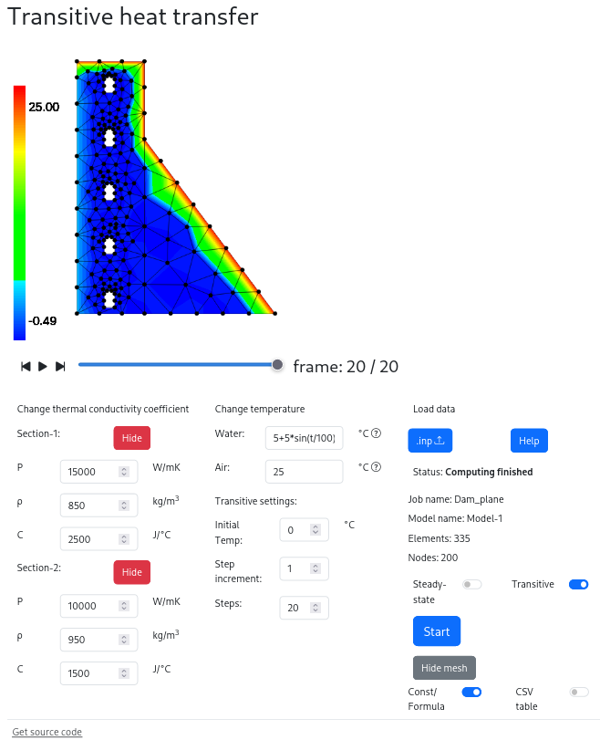

# heat-transfer
Bachelor's Thesis

## Description
This project is a CAE web application for calculating thermal conductivity in a two-dimensional case. To work with it, you need an .inp file. After uploading the .inp file, you can modify certain material settings and boundary conditions. Following this, you can compute thermal conductivity and obtain graphs.


## Demo
You can try application [here](https://catinbeard.github.io/heat-transfer/).  
If you need .inp file for testing, you can get it in [fixtures folder](fixtures/inp/)


## License

This project is licensed under the terms of the MIT License. See the [LICENSE](LICENSE) file for details.

## Build

To get started with heat-transfer, follow these steps:

1. Clone the repository:  
  ```git clone https://github.com/CatInBeard/heat-transfer.git```

2. Move to project directory :   
```cd heat-transfer```

3. Install dependencies:  
```npm i```

4. Run localhost dev verison:  
```npm start```

5. Build static production version:  
```npm run build```

### Docker build  
If you have installed docker, you can build project with deploy.sh:  
```deploy.sh```

### Deploy on github pages

The gh-pages-deploy workflow automatically builds the project and creates a build copy in the gh-pages branch. To allow the workflow to push to the gh-pages branch, you should go to the repository settings -> Actions -> General -> Workflow permissions and set Read and Write permissions. Next, you need to go to the repository settings -> Pages and set: Source: Deploy from a branch, Branch: gh-pages, /root.